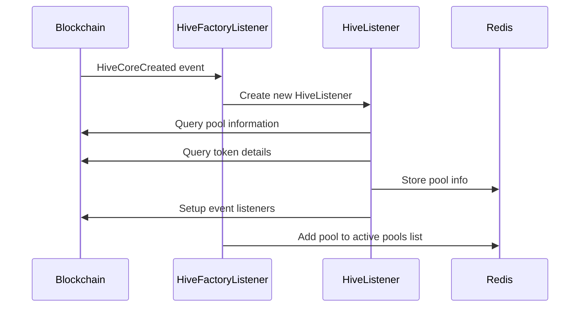
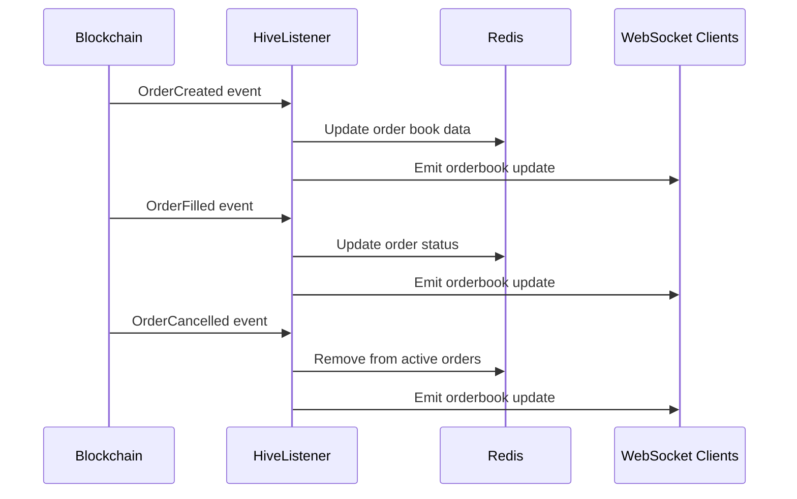
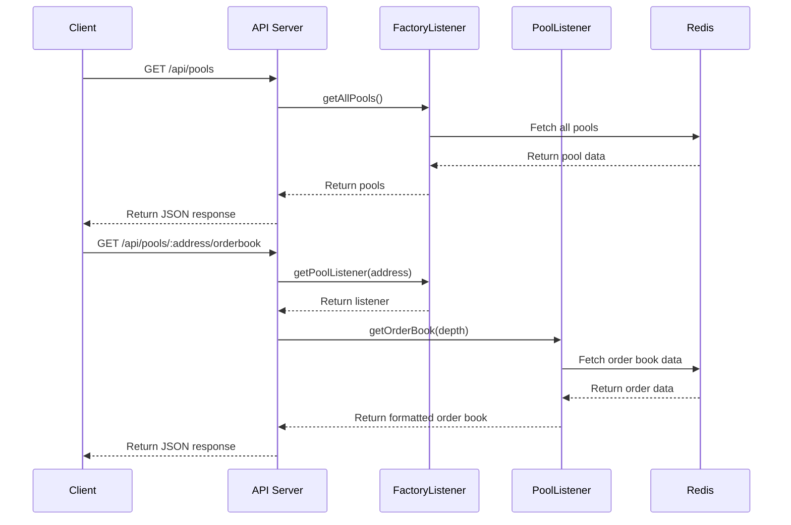
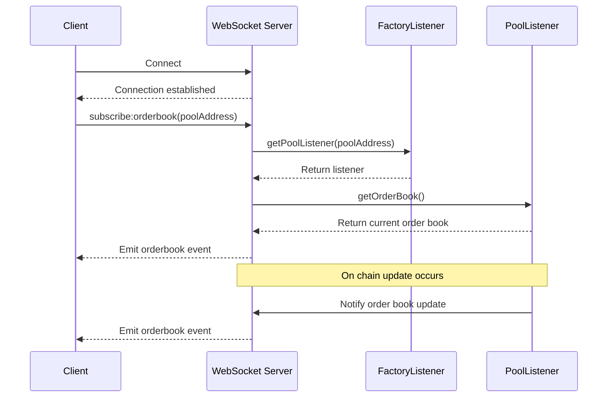

# Hive Exchange Backend

> **Quick Links:**  
> 📝 [Smart Contract Repository](https://github.com/akbaridria/hive-contract)  
> 🔄 [dApp Repository](https://github.com/akbaridria/hive-app)
> 🌎 [dApp link](https://hive-app-delta.vercel.app/)

A backend service for the Hive decentralized exchange that provides REST API and WebSocket interfaces for interacting with on-chain liquidity pools.

## Project Overview

Hive Exchange Backend is a Node.js application that monitors blockchain events for Hive pools, maintains order book information in Redis, and exposes this data through REST API endpoints and real-time WebSocket notifications.

## Architecture

The system consists of several key components:

- **Factory Listener**: Monitors the Hive Factory contract for new pool creation
- **Pool Listeners**: Track individual pool events and order books
- **Redis Cache**: Stores order book and pool information
- **REST API**: Provides endpoints for querying pool and order data
- **WebSocket Server**: Delivers real-time updates to connected clients

## Setup

### Prerequisites

- Node.js (v14+)
- Redis server
- Access to Ethereum JSON-RPC provider

### Installation

```bash
# Clone the repository
git clone https://github.com/akbaridria/hive-server
cd hive-server

# Install dependencies
npm install

# Set up environment variables (see .env.example)
cp .env.example .env
# Edit .env file with your configuration

# Build the project
npm run build

# Start the server
npm run start:prod
```

## Sequence Diagrams

### Pool Creation and Initialization



### Order Book Updates



### Client API Flow



### WebSocket Communication



## API Reference

### Pool Endpoints

- `GET /api/pools`: List all available pools
- `GET /api/pools/:address`: Get information about a specific pool

### Order Book Endpoints

- `GET /api/pools/:address/orderbook`: Get order book for a pool
- `GET /api/pools/:address/:trader/orders`: Get a trader's orders in a pool
- `GET /api/pools/:address/:trader/market-orders`: Get a trader's market orders
- `GET /api/pools/:address/orders/:id`: Get details of a specific order
- `GET /api/pools/:address/get-amount-out`: Calculate expected output amount

## WebSocket Events

- `subscribe:orderbook`: Subscribe to order book updates for a pool
- `orderbook`: Event emitted when order book changes